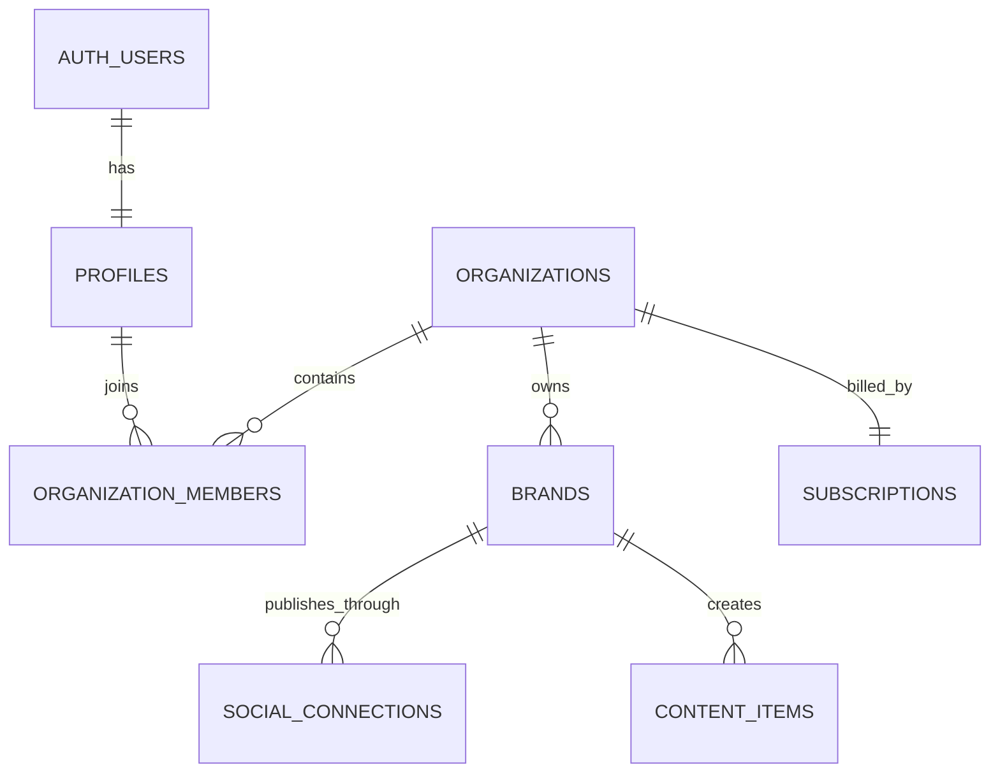
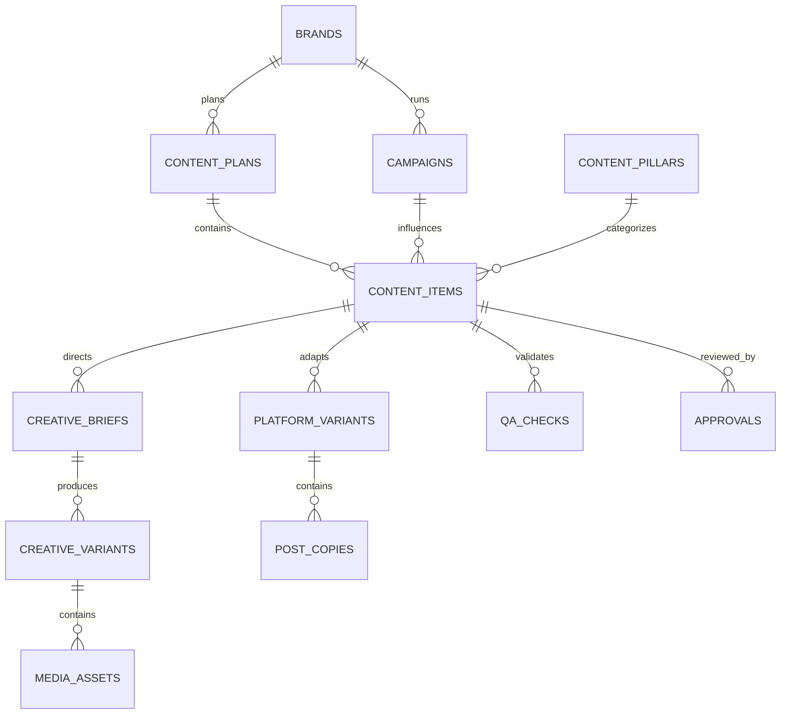
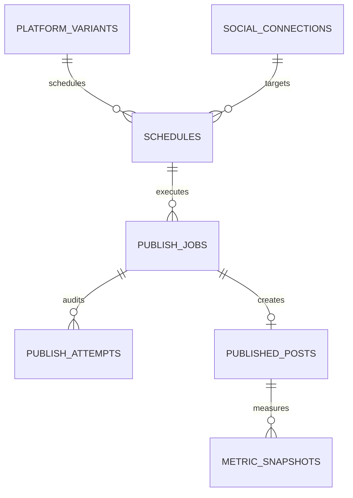

# Rithena Database Schema

## Purpose

Rithena is a multi-tenant autonomous social-media operator. The database must preserve one continuous content record across planning, creation, review, publishing, analytics, and learning while strictly isolating each organization's data.

This design implements the core data model described in `rithena/PRODUCT.md`. It intentionally excludes post-MVP competitor intelligence, trend intelligence, agency hierarchy, and enterprise permission systems.

## Ownership model



A profile does not directly own a brand. Access follows this path:

```text
auth.users
  -> profiles
    -> organization_members
      -> organizations
        -> brands
```

This supports one user in multiple organizations, teammates in one organization, and multiple brands under a plan without changing the ownership model later.

## Tenant isolation

Every tenant-owned record carries an `organization_id`, even where the organization could be inferred through a brand or content item. This provides:

- direct, efficient organization-scoped row-level security;
- fast billing, usage, and audit queries;
- explicit ownership in background jobs;
- composite foreign keys that prevent cross-organization references.

Authenticated users can only access organizations represented in `organization_members`. Membership changes require an organization owner/admin. Connection credentials, publishing records, metrics, usage, and billing mutations are restricted to trusted backend code.

## 1. Accounts and organizations

| Table | Important fields | Responsibility |
| --- | --- | --- |
| `profiles` | `id`, `full_name`, `avatar_url`, `timezone` | Application identity linked one-to-one with `auth.users` |
| `organizations` | `id`, `name`, `slug`, `timezone`, `created_by` | Tenant, workspace, and billing boundary |
| `organization_members` | `organization_id`, `user_id`, `role` | Many-to-many user access with `owner`, `admin`, and `member` roles |
| `subscriptions` | `organization_id`, `plan_code`, `status`, trial and provider fields | Organization plan and trial state |

An authentication trigger creates a profile for every new Auth user. An organization trigger creates the initial owner membership atomically.

## 2. Brand Brain and connections

| Table | Important fields | Responsibility |
| --- | --- | --- |
| `industry_playbooks` | `key`, `name`, `strategy_config` | Shared structured industry strategies |
| `brands` | `organization_id`, `name`, `slug`, `website_url`, `description`, `timezone`, `status` | Central business/brand record |
| `brand_sources` | source type/URL, ingestion status, metadata | Websites, social profiles, uploads, and manual sources |
| `brand_facts` | key/value, confidence, verification and provenance fields | Business truth separated from creative preferences |
| `brand_preferences` | category/key/value, weight, evidence count | Voice, visuals, CTAs, banned treatments, and learned preferences |
| `brand_assets` | asset type, storage path, MIME and dimensions | Logos, reference media, fonts, and brand assets |
| `goals` | goal type, priority, active state | Visibility, leads, authority, education, growth, and promotion goals |
| `content_pillars` | name, target percentage, description | Brand Content DNA |
| `autopilot_policies` | mode, category, risk, approval policy | Content-specific trust and review rules |
| `social_connections` | platform identity, status, scopes, credential reference, health | OAuth publishing destinations |

OAuth credentials are represented by an opaque `credentials_reference`. Raw access and refresh tokens must be encrypted in a server-side secret store and must never be returned to browser clients.

## 3. Planning and content creation



| Table | Responsibility |
| --- | --- |
| `campaigns` | Owner-supplied launches, promotions, dates, facts, audience, CTA, and approval policy |
| `content_plans` | Versioned weekly strategy generated before expensive media work |
| `content_items` | Canonical post record shared by Home, Calendar, Review, Content, and Analytics |
| `creative_archetypes` | Reusable global structures such as Problem -> Solution, Tutorial, FAQ, or Checklist |
| `creative_briefs` | Objective, viewer, story, treatment, shot plan, overlays, CTA, and audio direction |
| `creative_variants` | Alternative hooks, visuals, pacing, copy, or complete treatments |
| `media_assets` | Generated/uploaded images, videos, audio, thumbnails, and carousel slides |
| `platform_variants` | Instagram/Facebook/LinkedIn/TikTok/YouTube adaptation of a content item |
| `post_copies` | Versioned platform-native headline, caption, hashtags, CTA, title, and description |
| `qa_checks` | Brand, copy, visual, video, and policy QA results and required action |
| `approvals` | Append-only approval, rejection, change request, or skip history |

### Central content state machine

`content_items.status` uses the canonical lifecycle:

```text
DRAFT_PLAN -> PLANNED -> GENERATING -> QA -> READY_FOR_REVIEW
-> APPROVED -> SCHEDULED -> PUBLISHING -> PUBLISHED

Exit/error states: FAILED, SKIPPED, ARCHIVED
```

Calendar, Review, Content, publishing, and analytics never create competing post records.

## 4. Scheduling, publishing, analytics, and learning



| Table | Responsibility |
| --- | --- |
| `schedules` | Time, timezone, platform variant, and publishing connection |
| `publish_jobs` | Idempotent async publishing lifecycle and retry state |
| `publish_attempts` | Immutable audit history for every provider attempt |
| `published_posts` | Remote post identity, URL, and authoritative publish result |
| `metric_snapshots` | Time-series reach, views, retention, engagement, clicks, and conversions |
| `generation_jobs` | Async plan, copy, image, video, render, and QA work with cost/error tracking |
| `learning_signals` | Weighted approvals, edits, rejections, regeneration, and performance evidence |
| `performance_insights` | User-facing conclusions supported by evidence |
| `recommendations` | Strategy adjustments that can be accepted or ignored |
| `usage_events` | Allowance and provider/model cost accounting |
| `notifications` | Approval, publishing, connection, and generation alerts for a specific user |

`publish_jobs.idempotency_key` is unique so retries cannot silently create duplicate remote posts.

## Data-shape decisions

- Core relationships and queryable dimensions use typed columns and foreign keys.
- Flexible provider payloads, creative structures, QA issues, and evidence use `jsonb`.
- Canonical states and closed product vocabularies use PostgreSQL enums.
- Mutable records use `created_at` and `updated_at`; event/audit tables remain append-only.
- Media stores bucket/path metadata rather than permanent public URLs so signed delivery remains possible.
- Facts preserve source URL, excerpt, confidence, verification state, and last verification time.
- Learning signals are individual weighted observations. A single rejection or edit does not permanently rewrite a preference.

## Migration layout

The initial schema is split into four ordered migrations:

1. `core_accounts_and_organizations`
2. `brand_brain_and_connections`
3. `content_creation_pipeline`
4. `publishing_learning_and_billing`

The split keeps review and failure diagnosis manageable while still establishing the entire initial product schema in one migration set.
